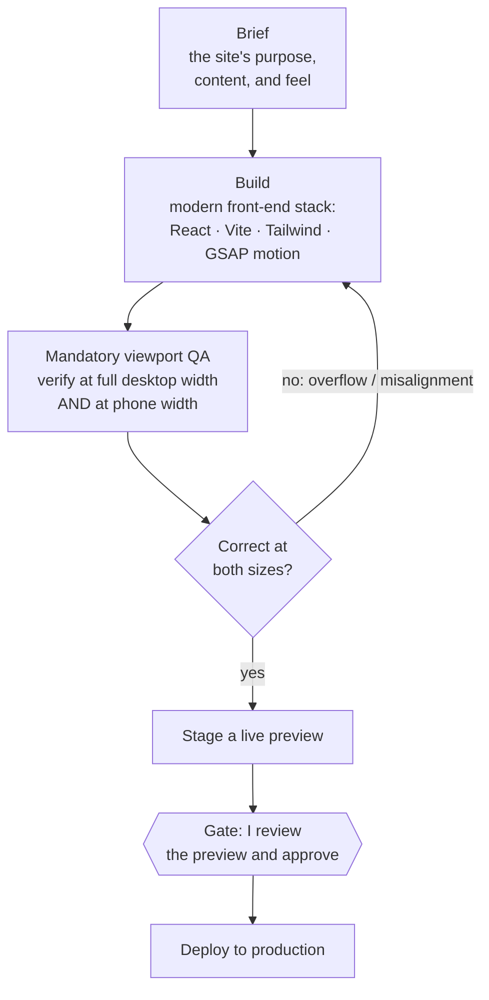

# Case Study: Production Websites, AI-Built and Pixel-QA'd

> AI-generated websites usually look like AI-generated websites: generic, slightly broken on mobile, "good enough." I built a system that produces genuinely cinematic, production-grade sites on a modern stack, with mandatory pixel-level QA at desktop and phone widths and a human gate before anything goes live.

**Author:** Paul Arceneaux, founder of [Snap2Flow](https://snap2flow.com)
**What this is:** A narrative walkthrough of a production website-building system. No source code is published here.

---

## The problem

"AI builds your website" usually delivers one of two disappointments. Either it's a bland template that looks like everyone else's, or it's an impressive-looking desktop mockup that falls apart the moment a real person opens it on a phone: text overlapping, layout broken, animations stuttering.

The reason is that most AI site generation stops at "it rendered." Nobody checks it the way a careful designer would: at an exact desktop width, at an exact phone width, looking for the overflow, the misalignment, the thing that's 8 pixels off. So the polish that separates a credible business site from an obvious template just never happens.

I wanted AI-built sites that clear the bar a real design studio sets: modern, animated, and correct on every screen, without me hand-coding each one.

## The approach

I built a website builder agent that works on a professional front-end stack and is *required* to verify its own work at real viewport sizes before any site is considered done. Build, then prove it's correct at desktop and phone, then stage a preview, then wait for me to approve the deploy.

**Brief.** The site's purpose, content, and the feel it needs to convey.

**Build.** The agent builds on a current, professional front-end stack: a modern React setup with a fast build tool, a utility-first styling system, and a real animation library for the cinematic motion that makes a site feel alive instead of static. Single-page by default; multi-page with proper routing when the project calls for it.

**Mandatory viewport QA.** This is the part almost everyone skips and the reason the output is different. Before a site is "done," the agent is *required* to inspect it at a full desktop width **and** at a phone width, looking for exactly the failures that betray an amateur build: overflow, misalignment, broken responsive behavior. If it's wrong at either size, it goes back. "It rendered" is not the finish line. "It's correct at the sizes real people actually use" is.

**Stage a preview.** The finished site is deployed to a private preview link, not straight to the public.

**Gate.** Going live is a hard stop. The site is **never** deployed to production until I review the preview and explicitly approve it.

## How it works in practice

The discipline lives in two places most AI builders don't have one: the **mandatory dual-viewport check** and the **human deploy gate.**

The viewport check is what kills the "looks great on my screen, broken on a phone" failure mode at the source. The agent doesn't get to call a site finished on the strength of a desktop render; it has to confirm the phone width is clean too, every time. That single requirement is most of the gap between a template-grade result and a studio-grade one.

The deploy gate is what keeps anything half-finished from ever going public. A preview gets staged; I look at the real thing; only then does it go live. Public-facing and hard to undo, so it waits for a human.

## What's under the hood

- **A professional front-end stack, not a page builder.** Modern React, a fast modern build tool, utility-first styling, and a real animation library: the same kind of stack a front-end studio would reach for, which is why the output reads as cinematic rather than canned.
- **Viewport QA as a hard requirement, not a suggestion.** Verification at desktop and phone widths is built into the definition of "done." The most common AI-site failure is engineered out by making the check mandatory.
- **Single-page and multi-page.** Simple sites are one page by default; larger sites get proper multi-page routing when the project needs it; the system scales to the job.
- **A preview-then-approve deploy flow.** Every site stages to a private preview first; production deploy waits for explicit human approval. (Same gate philosophy as the rest of my work; see the [three-layer architecture](https://github.com/paularceneaux/case-study-three-layer-architecture).)
- **A repeatable build directive.** The whole process (stack, structure, the QA requirement, the deploy gate) is captured as a standard procedure, so quality is consistent across builds instead of depending on luck.

## Results

- **Cinematic, production-grade sites** on a modern professional stack: animated and polished, not template-flat.
- **Correct on desktop and phone, every time:** mandatory dual-viewport QA closes the single most common AI-site failure mode.
- **Scales from one page to many:** proper routing when a project needs more than a landing page.
- **Multiple sites built on this system:** the same disciplined pipeline, reused across projects.
- **Nothing goes public unreviewed:** every deploy passes a human gate after a real preview.

## Where this fits

This is the difference between "an AI made a website" and "a system produced a site you'd actually put your business behind." The leverage isn't just generating markup fast; it's the discipline wrapped around it: a real stack, a non-negotiable quality check at the sizes people actually use, and a human in command of the moment it goes live.

**Snap2Flow** builds enterprise-grade automation and AI systems for small and mid-sized businesses. → [snap2flow.com](https://snap2flow.com) · [LinkedIn](https://www.linkedin.com/in/paularceneauxofficial/)

---

*This case study describes a production system in narrative form. It intentionally does not publish the underlying source code or any client information.*
